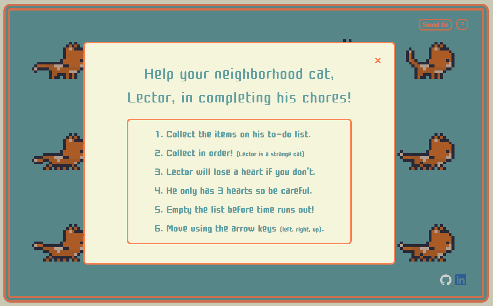
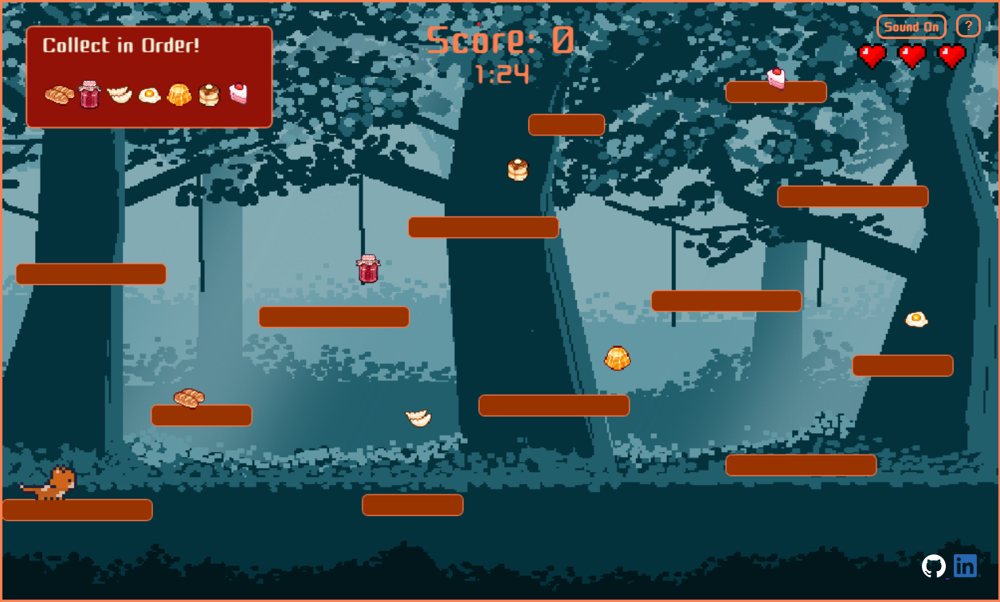
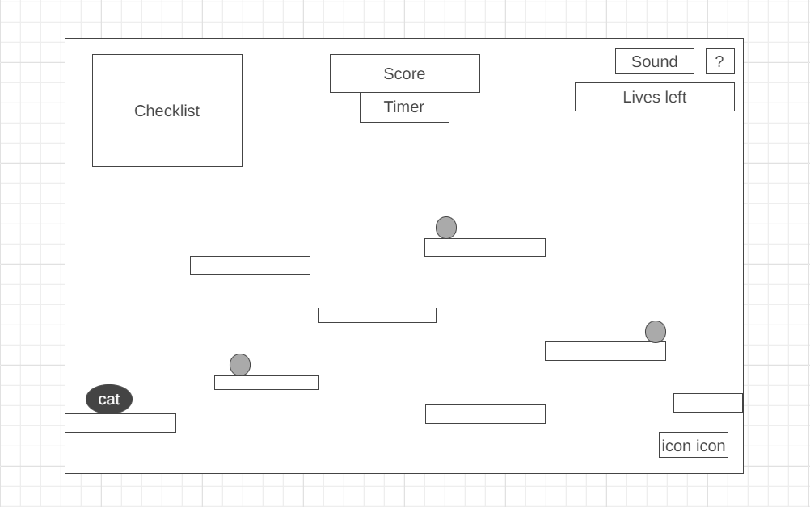

# Cat-Lector




# Description
[Cat-Lector](https://milner-chen.github.io/js_project/) is a game where you help a cat with its errands by collecting everything on it's to-do list. However, this cat is very peculiar so you must gather these items in the order listed. You will navigate through platforms with arrow keys and collect items when you come into contact with them. If you collect items out of order, you will lose a life. If collected properly, you will gain points. The game ends when time is up or when you lose all your lives.

# Wireframe

  - The help button in the upper right opens a modal with user instructions.
  - The sound button in the upper right allows the user to mute and unmute sound effects.
  - The nav links in the lower right lead to this project's GitHub repo and my LinkedIn.

# Technologies, Libraries, APIs
- Javascript
- Canvas API
- HTML5 and CSS3
- Webpack
- npm

# Functionality & MVPs
## In Cat-Lector, users are able to:
  - Naviate the character using the left, up, and right arrow keys.
  - See the order in which they need to collect the items
  - Collect items that are next on the list on contact
  - Lose a heart when an incorrect item is touched
  - See their current score and time
  ## In addition, this project includes:
  - User instructions in a modal on the initial screen

## Collision Detection
Collection of items is determined by rectangular collision detection. Check for when two objects are not overlapping on all four sides with the objects' position and dimensions. When any of these conditions are false, there is an overlap and a collision has occured. Manual adjustments were made because the dimensions of the sprites did not closely fit the actual size of the image.
  ```javascript
    hasCollison(rect1, rect2) {
        if (!(rect1.pos[0] + (rect1.width * .3) > rect2.pos[0] + (rect2.width) ||
            rect1.pos[0] + (rect1.width * .65) < rect2.pos[0] ||
            rect1.pos[1] + (rect1.height * .7) > rect2.pos[1] + (rect2.height) ||
            rect1.pos[1] + (rect1.height) < rect2.pos[1]
        )) {
            return true;
        } else {
            return false;
        }
    }
  ```

 
# Implementation Timeline

- Friday Afternoon & Weekend: Research on Canvas API, rendering and animation, and collision detection. Setup basic project structure. Render and move character with key-bindings. Implement collision detection with platforms.
- Monday: Work on screen boundaries, implementing gravity and velocity, and collision detection with items.
- Tuesday: Render hearts, removing hearts upon a collision. Render and update score, timer, and to-do list.
- Wednesday: Animate character sprites. Implement game over logic, game start and game restart. Add user instructions and links.
- Thursday: Add sound effects, styling, and final touches. Deploy to GitHub pages.

# Future Implementations
  - Randomize map and items
  - Have multiple levels